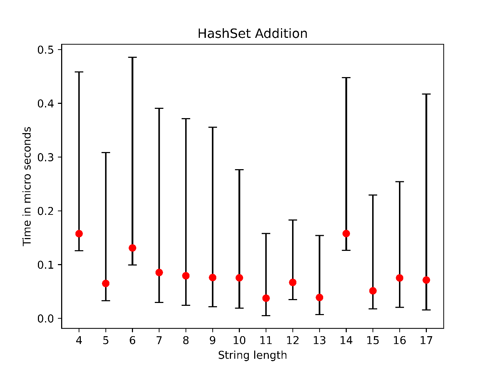
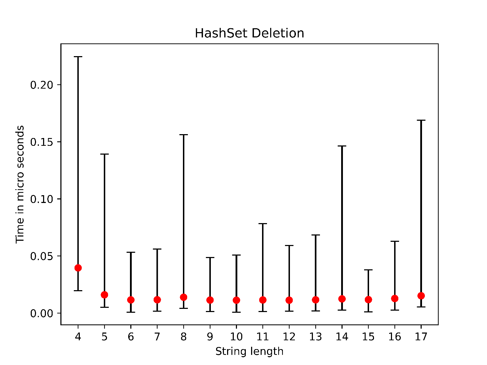
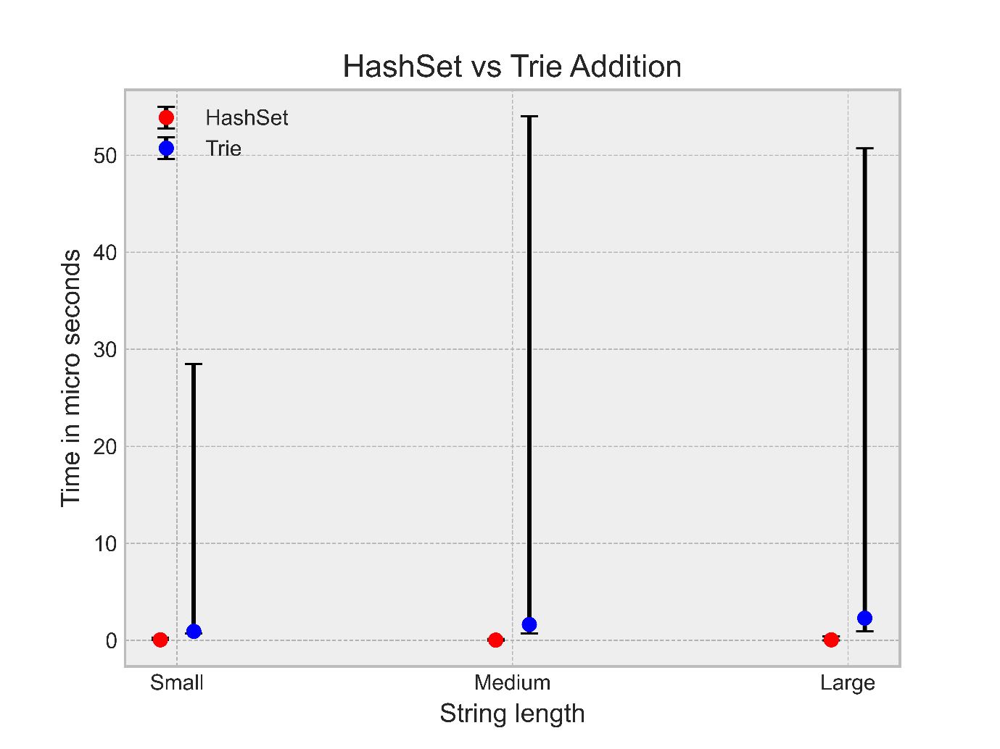
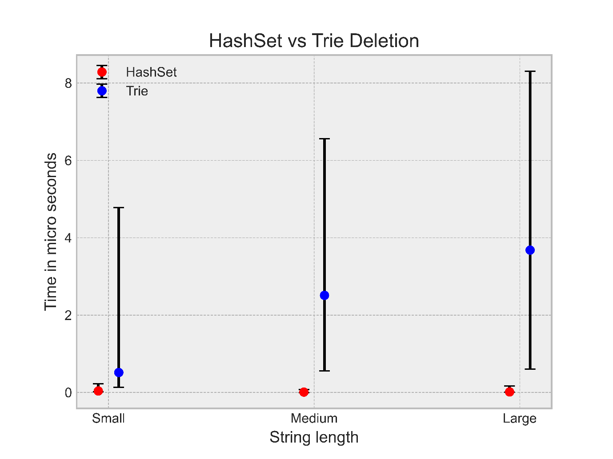
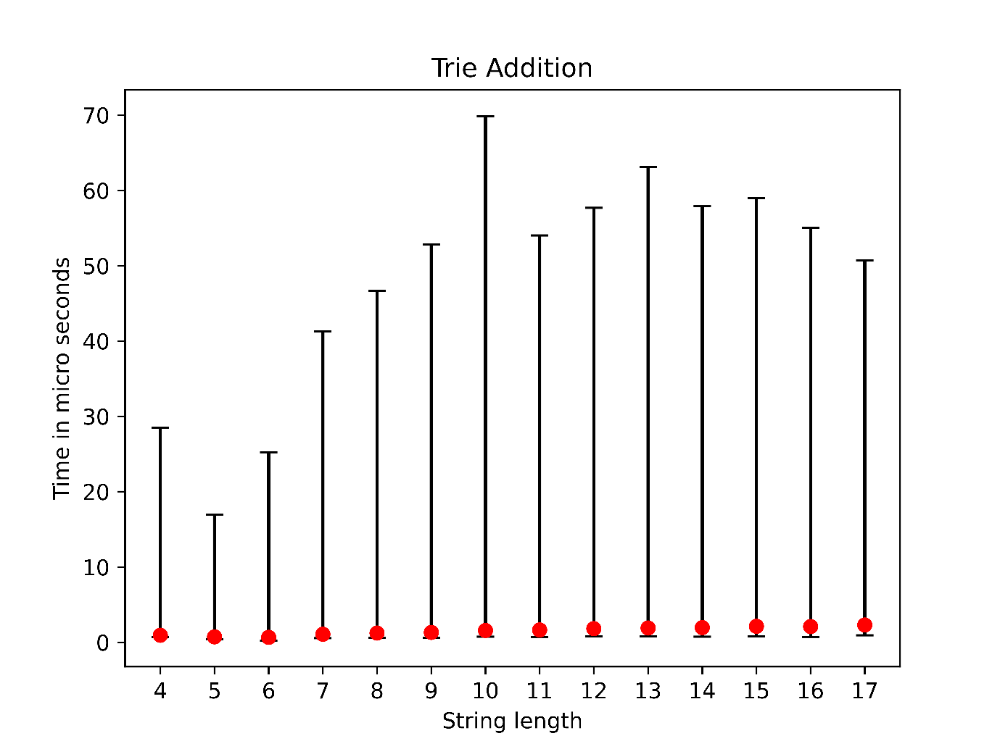
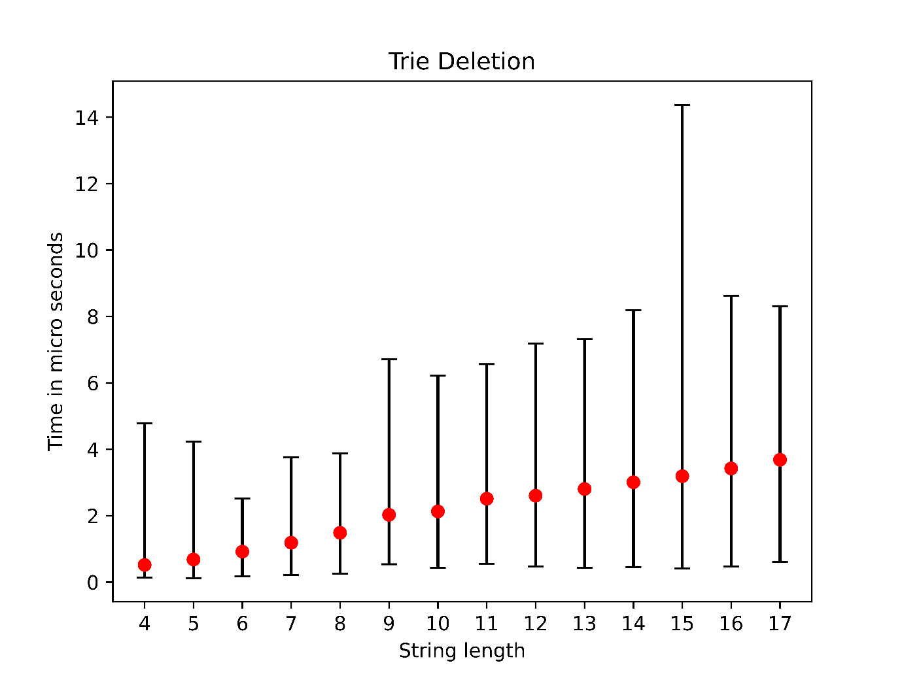

# Dictionary Implementation and Performance Analysis

## Project Overview

This project involves implementing a dictionary using two different data structures: HashSet and Trie. The performance of these implementations is analyzed and compared based on their efficiency in performing various operations such as adding, deleting, and checking for the existence of elements.

## Features

- **HashSet Implementation**: Utilizes Java's `HashSet` class to implement dictionary operations.
- **Trie Implementation**: Custom implementation of a Trie data structure to perform dictionary operations.
- **Performance Testing**: Analyzes and compares the performance of the two implementations.
- **Visualization**: Graphical representation of the performance analysis using Python's `matplotlib`.

## Project Structure

\`\`\`plaintext
├── src
│   ├── HashSetDictionary.java
│   ├── Node.java
│   ├── Trie.java
│   ├── TimeTest.java
│   └── README.md
\`\`\`

### HashSetDictionary.java
Implements dictionary operations using Java's `HashSet`.

### Node.java
Defines the nodes used in the Trie implementation.

### Trie.java
Custom implementation of a Trie data structure.

### TimeTest.java
Tests and compares the performance of the `HashSetDictionary` and `Trie` implementations.

## Key Highlights

### Object-Oriented Design
- **Encapsulation**: Private variables with public getter and setter methods ensure data hiding and encapsulation.

### Data Structures
- **HashSet**: Efficiently manages dictionary operations using a hash table.
- **Trie**: Provides an alternative implementation with a tree-like structure for dictionary operations.

### Performance Analysis
- **Time Testing**: Measures the time taken for add, delete, and contains operations for both implementations.
- **Visualization**: Graphs illustrate the performance differences between `HashSet` and `Trie`.

## Installation

To run this project, you need to have Java installed on your system. Clone the repository and compile the Java files:

\`\`\`bash
git clone https://github.com/yourusername/dictionary-performance-analysis.git
cd dictionary-performance-analysis/src
javac *.java
\`\`\`

Run the performance tests:

\`\`\`bash
java TimeTest
\`\`\`

## Usage

The Dictionary Implementation and Performance Analysis project allows you to:

- **Add Elements**: Add new elements to the dictionary.
- **Delete Elements**: Remove elements from the dictionary.
- **Check Existence**: Verify if an element exists in the dictionary.

## Testing

Extensive testing was conducted to ensure the reliability and accuracy of the system. Key test cases include:

- Adding multiple elements and ensuring they are correctly stored.
- Removing elements and verifying the integrity of the remaining elements.
- Handling erroneous inputs gracefully and maintaining program stability.

## Diagrams

### Performance Graph 1

### Performance Graph 2

### Performance Graph 3

### Performance Graph 4

### Performance Graph 5

### Performance Graph 6

## Author

Nikola Nikolov [nin6]  
Email: [Nin6@aber.ac.uk](mailto:Nin6@aber.ac.uk)

## License

This project is licensed under the MIT License - see the [LICENSE](LICENSE) file for details.
